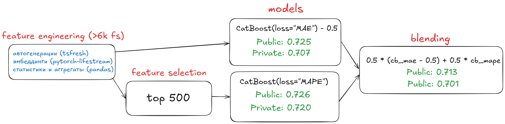

# alfa-challnge

- Feature generation
  - [tsfresh](alfa_challenge/features_tsfresh.ipynb)
    - автогенерации tsfresh для временных рядов в разрезе дня, недели, месяца с разными аггрегациями по amount
  - [pytorch-lifestream](alfa_challenge/features_coles.ipynb)
    - Эмбеддинги coles
  - [Статистики и аггрегаты](alfa_challenge/features_aggs.ipynb)
    - Общие для client_num
    - Amount в разрезе часа, дня, недели, месяца
    - Аггрегаты в проекции на mcc_codes
    - Временные статистики - расстояние между первой и последней транзакцией и другие.
- [Feature selection](alfa_challenge/feature_selection.ipynb)
  - С помощью встроенного в CatBoost `select_features` сначала до 1000 фичей, потом до 500.
- Modelling
  - [Catboost with MAE loss](alfa_challenge/modelling_catboost_MAE.ipynb)
    - Отнимаю 0.5 от предсказаний, чтобы сместить предсказания, так как WMAE метрика в сореве даёт больший вес близким к 0 таргетам.
    - Лучшее качество при обучении на всех фичах
  - [Catboost with MAPE loss](alfa_challenge/modelling_catboost_MAPE.ipynb)
    - В теории должен смещать предсказания ближе к 0 из-за несимметричности MAPE.
    - Лучшее качество при обучении на топ-500 фичах.
- [Blend](alfa_challenge/final_blend.ipynb)
  - Объединяю две модели с весами 0.5
